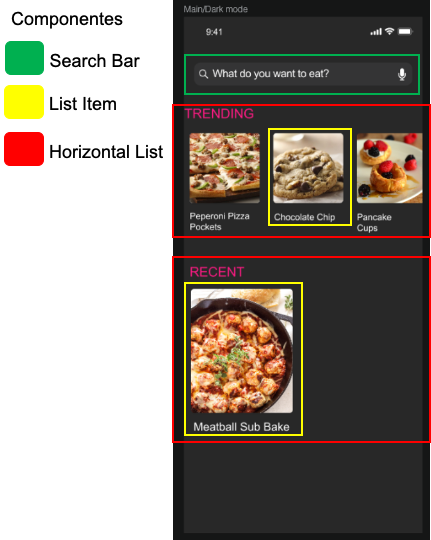

- [App Recetario de cocina](#app-recetario-de-cocina)
  - [Objetivos](#objetivos)
  - [Instrucciones](#instrucciones)
  - [Entregables](#entregables)
  - [Puntos](#puntos)
  - [Tecnologías](#tecnologías)
  - [Requerimientos funcionales](#requerimientos-funcionales)
  - [Diseño](#diseño)
  - [Flujo de trabajo sugerido](#flujo-de-trabajo-sugerido)
  - [Demo](#demo)
  - [Requerimientos no-funcionales](#requerimientos-no-funcionales)
  - [Recursos](#recursos)
  
# App Recetario de cocina

  Atributo |  Valor
 --- | --- |
 Tipo | Colaborativo
 Estrategia | Mob Programming
 Modo | Síncrono
 Dedicación | 35 horas
 Duración | 10 días

## Objetivos

- Iniciar en la programación con React Native
- Introducir el modelo de React Native de programación por componentes
- Introducir el desarrollo de interfaces para aplicaciones móviles con react native

## Instrucciones

- Deberán trabajar en equipo de manera colaborativa y aplicando la dinámica de mob programming para desarrollar una aplicación móvil que permita mostrar diferentes tipos de recetas de cocina (detalles en la sección de [requerimientos funcionales](#requerimientos-funcionales)).
- En la actividad de Github (commits) se deberá observar la participación de todos los participantes
- En cada commit se deben registrar todos los participantes activos (co-author commits)
- En los commits se debe observar a rotación de los participantes, es decir, quien hace el commit no es siempre la misma persona.

## Entregables

- Código fuente en este repositorio
- Archivo README.md actualizado
- El código debe incluir pruebas unitarias
- La puntuación obtenida por Codacy, CodeClimate o similar debe ser A o lo equivalente
- Se deben incluir los badges de los analizadores de código estáticos (codacy, codeclimate, etc.)
- La versión final de tu código deberá estar en la rama principal

## Puntos

- Número de commits como primer autor
- Número de commits como co-author
- Frecuencia de los commits (# de commits realizados en días diferentes)
- Tamaño de los commits (líneas de código agregadas)

## Tecnologías

- Javascript ó Typescript
- ESLint
- Jest
- Codacy, CodeClimate, CodeCov

## Requerimientos funcionales

La empresa Foo Corp necesita una App para poder visualizar las recetas de cocina de sus restaurantes. La App deberá cumplir con los siguientes requerimientos:
  
- Pantalla principal
  - Listado con las recetas que están de moda (trending)
  - Listado con las recetas más recientes
  - Por cada receta se debe mostrar una foto del platillo de la receta y el nombre de la receta
- Pantalla detalle
  - Foto del platillo de la receta
  - Categoría de la receta (trending/recent)
  - Nombre de la receta
  - Porciones por receta (servings)
  - Listado de ingredientes con nombre y cantidad
  - Botón "me gusta" que servirá para etiquetar a las recetas favoritas

## Diseño

En la carpeta [design](/design) se encuentra el diseño solicitado en formato PNG e Invision.

## Flujo de trabajo sugerido

- Divide tu trabajo en pequeñas tareas
- Para cada pantalla identifica o clasifica los diferentes compones que se presentan
- Inicia programando los componentes individuales procurando que estos sean reutilizables
- Una vez que tienes listos los componentes integra las pantallas.

Por ejemplo la primer pantalla se puede subdividir en los siguientes 3 componentes:

- Search Bar. La barra que se encuentra en la parte superior
- List Item. Cada elemento que se muestra dentro de las listas
- Horizontal List. Lista scrollable horizontal que incluye las recetas dependiendo de la categoría.

Al ser reutilizables `List Item` y `Horizontal List`pueden servir tanto para trending como para recent, simplemente incluyendo propiedades que permitan indicar el alto del componente así como su contenido (lista de recetas).

## Demo

## Requerimientos no-funcionales

- Base de datos
  - Los datos (recetas) se tomarán de un archivo local en formato JSON
- Calidad
  - Utilizar un estilo de código estandarizado (revisado por Eslint)
  - Puntuación **A** obtenida en CodeClimate ó similares
- Ejecución
  - Puede ejecutarse en Android y/o iOs
- Código fuente
  - Orientado a Objetos
  - Métodos pequeños
  - Aplicar los principios SOLID
  
## Recursos

- Estructura tu pensamiento o forma de trabajo por componentes
  - [Thinking in React](https://reactjs.org/docs/thinking-in-react.html)
  - [Thinking in React — few tips](https://medium.com/@5066aman/thinking-in-react-few-tips-6b32fbe835a3)
  - [Thinking in components - building a todo app](https://softchris.github.io/books/react/thinkingincomponents/)
- React Native
  - [React Native CLI](https://reactnative.dev/docs/environment-setup)
  - [React Native Navigation](https://reactnavigation.org/)
  - [Presentando Hooks](https://es.reactjs.org/docs/hooks-intro.html)
  - [Debugging](https://reactnative.dev/docs/debugging)
- Calidad del código
  - [ESLint](https://eslint.org/)
  - [CodeClimate](https://codeclimate.com/)
  - [Codacy](https://codacy.com/)
  - [Codecov](https://codecov.com/)
